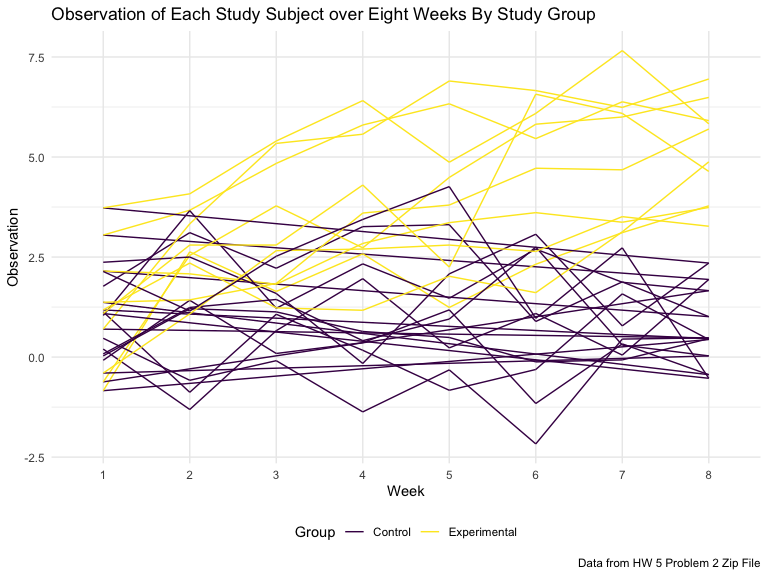
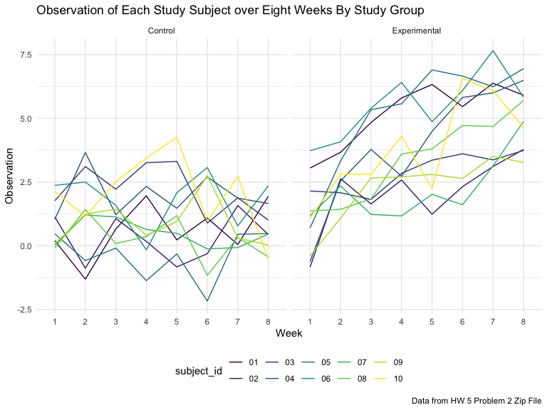
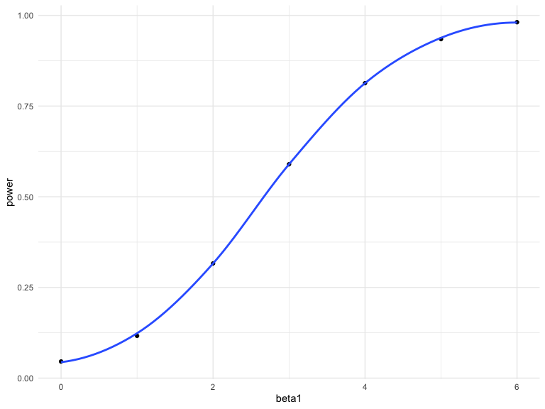
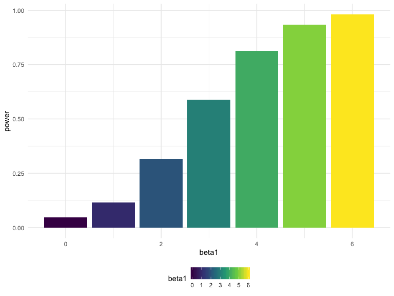

Homework 5
================
Kodiak Soled
11/2/2019

## Problem 1

#### Read in Data

First, I read in the missing data.

``` r
set.seed(10)

iris_with_missing = 
  iris %>% 
  map_df(~replace(.x, sample(1:150, 20), NA)) %>%
  mutate(Species = as.character(Species))
```

#### Create a Function to Address Missing Data

In order to fill in the missing data, I first needed to write a
`function` that:

  - Took a vector as an argument
  - `Replace`d missing values:
      - of numeric variables with the mean of non-missing values
      - of character variables with `"virginica"`
  - Returned the resulting vector

<!-- end list -->

``` r
tidy_iris = function(x) {
  
  if (!is.numeric(x) & !is.character(x)) {
    stop("Argument x should be numeric or character")
  } else if (is.character(x)) {
    x = replace(x, is.na(x) == TRUE, "virginica")
  } else if (is.numeric(x)) {
    mean_x = mean(x, na.rm = TRUE)
    x = replace(x, is.na(x) == TRUE, mean_x)
  }
  
}
```

#### Create a Map Statement

Then, I applied this function to the `iris_with_missing` dataset using a
`map` statement and `bind_rows` in order to combine the 5 datasets into
a single one:

``` r
output = 
  map(iris_with_missing, tidy_iris) %>%
  bind_rows()
```

#### Table of New Iris Data

Here is a reader-friendly table the first 30 observations of the
replaced iris dataset:

``` r
head(output, n = 30) %>%
  janitor::clean_names() %>%
  knitr::kable(digits = 1, caption = "Iris Dataset (First 30 Observations)") %>%
  kable_styling(bootstrap_options = c("striped", "condensed", font_size = 12))
```

<table class="table table-striped table-condensed" style="margin-left: auto; margin-right: auto;">

<caption>

Iris Dataset (First 30 Observations)

</caption>

<thead>

<tr>

<th style="text-align:right;">

sepal\_length

</th>

<th style="text-align:right;">

sepal\_width

</th>

<th style="text-align:right;">

petal\_length

</th>

<th style="text-align:right;">

petal\_width

</th>

<th style="text-align:left;">

species

</th>

</tr>

</thead>

<tbody>

<tr>

<td style="text-align:right;">

5.1

</td>

<td style="text-align:right;">

3.5

</td>

<td style="text-align:right;">

1.4

</td>

<td style="text-align:right;">

0.2

</td>

<td style="text-align:left;">

setosa

</td>

</tr>

<tr>

<td style="text-align:right;">

4.9

</td>

<td style="text-align:right;">

3.0

</td>

<td style="text-align:right;">

1.4

</td>

<td style="text-align:right;">

0.2

</td>

<td style="text-align:left;">

setosa

</td>

</tr>

<tr>

<td style="text-align:right;">

4.7

</td>

<td style="text-align:right;">

3.2

</td>

<td style="text-align:right;">

1.3

</td>

<td style="text-align:right;">

0.2

</td>

<td style="text-align:left;">

setosa

</td>

</tr>

<tr>

<td style="text-align:right;">

4.6

</td>

<td style="text-align:right;">

3.1

</td>

<td style="text-align:right;">

1.5

</td>

<td style="text-align:right;">

1.2

</td>

<td style="text-align:left;">

setosa

</td>

</tr>

<tr>

<td style="text-align:right;">

5.0

</td>

<td style="text-align:right;">

3.6

</td>

<td style="text-align:right;">

1.4

</td>

<td style="text-align:right;">

0.2

</td>

<td style="text-align:left;">

setosa

</td>

</tr>

<tr>

<td style="text-align:right;">

5.4

</td>

<td style="text-align:right;">

3.9

</td>

<td style="text-align:right;">

1.7

</td>

<td style="text-align:right;">

0.4

</td>

<td style="text-align:left;">

setosa

</td>

</tr>

<tr>

<td style="text-align:right;">

5.8

</td>

<td style="text-align:right;">

3.4

</td>

<td style="text-align:right;">

1.4

</td>

<td style="text-align:right;">

0.3

</td>

<td style="text-align:left;">

setosa

</td>

</tr>

<tr>

<td style="text-align:right;">

5.0

</td>

<td style="text-align:right;">

3.4

</td>

<td style="text-align:right;">

1.5

</td>

<td style="text-align:right;">

0.2

</td>

<td style="text-align:left;">

setosa

</td>

</tr>

<tr>

<td style="text-align:right;">

4.4

</td>

<td style="text-align:right;">

2.9

</td>

<td style="text-align:right;">

1.4

</td>

<td style="text-align:right;">

0.2

</td>

<td style="text-align:left;">

setosa

</td>

</tr>

<tr>

<td style="text-align:right;">

4.9

</td>

<td style="text-align:right;">

3.1

</td>

<td style="text-align:right;">

3.8

</td>

<td style="text-align:right;">

0.1

</td>

<td style="text-align:left;">

setosa

</td>

</tr>

<tr>

<td style="text-align:right;">

5.4

</td>

<td style="text-align:right;">

3.1

</td>

<td style="text-align:right;">

1.5

</td>

<td style="text-align:right;">

0.2

</td>

<td style="text-align:left;">

setosa

</td>

</tr>

<tr>

<td style="text-align:right;">

4.8

</td>

<td style="text-align:right;">

3.4

</td>

<td style="text-align:right;">

1.6

</td>

<td style="text-align:right;">

0.2

</td>

<td style="text-align:left;">

setosa

</td>

</tr>

<tr>

<td style="text-align:right;">

5.8

</td>

<td style="text-align:right;">

3.1

</td>

<td style="text-align:right;">

1.4

</td>

<td style="text-align:right;">

0.1

</td>

<td style="text-align:left;">

setosa

</td>

</tr>

<tr>

<td style="text-align:right;">

4.3

</td>

<td style="text-align:right;">

3.0

</td>

<td style="text-align:right;">

3.8

</td>

<td style="text-align:right;">

0.1

</td>

<td style="text-align:left;">

setosa

</td>

</tr>

<tr>

<td style="text-align:right;">

5.8

</td>

<td style="text-align:right;">

4.0

</td>

<td style="text-align:right;">

3.8

</td>

<td style="text-align:right;">

0.2

</td>

<td style="text-align:left;">

setosa

</td>

</tr>

<tr>

<td style="text-align:right;">

5.7

</td>

<td style="text-align:right;">

4.4

</td>

<td style="text-align:right;">

1.5

</td>

<td style="text-align:right;">

0.4

</td>

<td style="text-align:left;">

setosa

</td>

</tr>

<tr>

<td style="text-align:right;">

5.4

</td>

<td style="text-align:right;">

3.9

</td>

<td style="text-align:right;">

1.3

</td>

<td style="text-align:right;">

0.4

</td>

<td style="text-align:left;">

setosa

</td>

</tr>

<tr>

<td style="text-align:right;">

5.1

</td>

<td style="text-align:right;">

3.5

</td>

<td style="text-align:right;">

1.4

</td>

<td style="text-align:right;">

1.2

</td>

<td style="text-align:left;">

setosa

</td>

</tr>

<tr>

<td style="text-align:right;">

5.7

</td>

<td style="text-align:right;">

3.8

</td>

<td style="text-align:right;">

1.7

</td>

<td style="text-align:right;">

0.3

</td>

<td style="text-align:left;">

setosa

</td>

</tr>

<tr>

<td style="text-align:right;">

5.1

</td>

<td style="text-align:right;">

3.8

</td>

<td style="text-align:right;">

1.5

</td>

<td style="text-align:right;">

1.2

</td>

<td style="text-align:left;">

setosa

</td>

</tr>

<tr>

<td style="text-align:right;">

5.4

</td>

<td style="text-align:right;">

3.4

</td>

<td style="text-align:right;">

1.7

</td>

<td style="text-align:right;">

0.2

</td>

<td style="text-align:left;">

setosa

</td>

</tr>

<tr>

<td style="text-align:right;">

5.1

</td>

<td style="text-align:right;">

3.7

</td>

<td style="text-align:right;">

1.5

</td>

<td style="text-align:right;">

0.4

</td>

<td style="text-align:left;">

virginica

</td>

</tr>

<tr>

<td style="text-align:right;">

4.6

</td>

<td style="text-align:right;">

3.6

</td>

<td style="text-align:right;">

1.0

</td>

<td style="text-align:right;">

0.2

</td>

<td style="text-align:left;">

setosa

</td>

</tr>

<tr>

<td style="text-align:right;">

5.8

</td>

<td style="text-align:right;">

3.3

</td>

<td style="text-align:right;">

3.8

</td>

<td style="text-align:right;">

0.5

</td>

<td style="text-align:left;">

setosa

</td>

</tr>

<tr>

<td style="text-align:right;">

4.8

</td>

<td style="text-align:right;">

3.4

</td>

<td style="text-align:right;">

1.9

</td>

<td style="text-align:right;">

0.2

</td>

<td style="text-align:left;">

virginica

</td>

</tr>

<tr>

<td style="text-align:right;">

5.0

</td>

<td style="text-align:right;">

3.0

</td>

<td style="text-align:right;">

3.8

</td>

<td style="text-align:right;">

0.2

</td>

<td style="text-align:left;">

setosa

</td>

</tr>

<tr>

<td style="text-align:right;">

5.0

</td>

<td style="text-align:right;">

3.4

</td>

<td style="text-align:right;">

1.6

</td>

<td style="text-align:right;">

0.4

</td>

<td style="text-align:left;">

virginica

</td>

</tr>

<tr>

<td style="text-align:right;">

5.2

</td>

<td style="text-align:right;">

3.5

</td>

<td style="text-align:right;">

1.5

</td>

<td style="text-align:right;">

0.2

</td>

<td style="text-align:left;">

setosa

</td>

</tr>

<tr>

<td style="text-align:right;">

5.8

</td>

<td style="text-align:right;">

3.4

</td>

<td style="text-align:right;">

1.4

</td>

<td style="text-align:right;">

0.2

</td>

<td style="text-align:left;">

setosa

</td>

</tr>

<tr>

<td style="text-align:right;">

4.7

</td>

<td style="text-align:right;">

3.2

</td>

<td style="text-align:right;">

1.6

</td>

<td style="text-align:right;">

0.2

</td>

<td style="text-align:left;">

setosa

</td>

</tr>

</tbody>

</table>

## Problem 2

#### Load in Data files

In order to create a tidy dataframe containing data from all
participants, including the subject ID, arm, and observations over time,
I first loaded in the 20 seperate datafiles using `list.files` (created
a dataframe with the file names):

``` r
study_data_2 = 
  list.files(path = "./data_hw5", full.names = FALSE) %>%
  tibble::enframe(name = NULL)
study_data_2
```

    ## # A tibble: 20 x 1
    ##    value     
    ##    <chr>     
    ##  1 con_01.csv
    ##  2 con_02.csv
    ##  3 con_03.csv
    ##  4 con_04.csv
    ##  5 con_05.csv
    ##  6 con_06.csv
    ##  7 con_07.csv
    ##  8 con_08.csv
    ##  9 con_09.csv
    ## 10 con_10.csv
    ## 11 exp_01.csv
    ## 12 exp_02.csv
    ## 13 exp_03.csv
    ## 14 exp_04.csv
    ## 15 exp_05.csv
    ## 16 exp_06.csv
    ## 17 exp_07.csv
    ## 18 exp_08.csv
    ## 19 exp_09.csv
    ## 20 exp_10.csv

#### Create Tidy Dataframe

Then, I iterated over the file names and read in the data (`read_csv`)
for each of the 20 subjects (from 20 strings to 1 string using `str_c`)
using `purrr::map` (and saving the result as a new variable in the
dataframe). I then `unnest`ed the variable “data” so I could see the
measurements for each subject across the eight weeks. I then tidied the
dataset so that there were `seperate` variables for study group (control
vs. experimental) and subject id and removed the “.csv” in the name
using `mutate` and `str_replace`. Finally, I put the dataframe into a
reader-friendly table using `knitr::kable` and made sure all the
measurements were rounded to 2 decimal places using `digits = 2`.

``` r
df_study_data_2 = 
  study_data_2 %>%
  mutate(
    data = map(value, ~read_csv(str_c("./data_hw5/", .x)))
  ) %>%
  unnest(cols = data) %>%
  separate(value, into = c("arm", "subject_id"), sep = "_") %>%
  mutate(subject_id = str_replace(subject_id, ".csv", ""))
df_study_data_2 %>%
  knitr::kable(digits = 2, caption = "Tidy Study Dataframe") %>%
  kable_styling(bootstrap_options = c("striped", "condensed", font_size = 12))
```

<table class="table table-striped table-condensed" style="margin-left: auto; margin-right: auto;">

<caption>

Tidy Study Dataframe

</caption>

<thead>

<tr>

<th style="text-align:left;">

arm

</th>

<th style="text-align:left;">

subject\_id

</th>

<th style="text-align:right;">

week\_1

</th>

<th style="text-align:right;">

week\_2

</th>

<th style="text-align:right;">

week\_3

</th>

<th style="text-align:right;">

week\_4

</th>

<th style="text-align:right;">

week\_5

</th>

<th style="text-align:right;">

week\_6

</th>

<th style="text-align:right;">

week\_7

</th>

<th style="text-align:right;">

week\_8

</th>

</tr>

</thead>

<tbody>

<tr>

<td style="text-align:left;">

con

</td>

<td style="text-align:left;">

01

</td>

<td style="text-align:right;">

0.20

</td>

<td style="text-align:right;">

\-1.31

</td>

<td style="text-align:right;">

0.66

</td>

<td style="text-align:right;">

1.96

</td>

<td style="text-align:right;">

0.23

</td>

<td style="text-align:right;">

1.09

</td>

<td style="text-align:right;">

0.05

</td>

<td style="text-align:right;">

1.94

</td>

</tr>

<tr>

<td style="text-align:left;">

con

</td>

<td style="text-align:left;">

02

</td>

<td style="text-align:right;">

1.13

</td>

<td style="text-align:right;">

\-0.88

</td>

<td style="text-align:right;">

1.07

</td>

<td style="text-align:right;">

0.17

</td>

<td style="text-align:right;">

\-0.83

</td>

<td style="text-align:right;">

\-0.31

</td>

<td style="text-align:right;">

1.58

</td>

<td style="text-align:right;">

0.44

</td>

</tr>

<tr>

<td style="text-align:left;">

con

</td>

<td style="text-align:left;">

03

</td>

<td style="text-align:right;">

1.77

</td>

<td style="text-align:right;">

3.11

</td>

<td style="text-align:right;">

2.22

</td>

<td style="text-align:right;">

3.26

</td>

<td style="text-align:right;">

3.31

</td>

<td style="text-align:right;">

0.89

</td>

<td style="text-align:right;">

1.88

</td>

<td style="text-align:right;">

1.01

</td>

</tr>

<tr>

<td style="text-align:left;">

con

</td>

<td style="text-align:left;">

04

</td>

<td style="text-align:right;">

1.04

</td>

<td style="text-align:right;">

3.66

</td>

<td style="text-align:right;">

1.22

</td>

<td style="text-align:right;">

2.33

</td>

<td style="text-align:right;">

1.47

</td>

<td style="text-align:right;">

2.70

</td>

<td style="text-align:right;">

1.87

</td>

<td style="text-align:right;">

1.66

</td>

</tr>

<tr>

<td style="text-align:left;">

con

</td>

<td style="text-align:left;">

05

</td>

<td style="text-align:right;">

0.47

</td>

<td style="text-align:right;">

\-0.58

</td>

<td style="text-align:right;">

\-0.09

</td>

<td style="text-align:right;">

\-1.37

</td>

<td style="text-align:right;">

\-0.32

</td>

<td style="text-align:right;">

\-2.17

</td>

<td style="text-align:right;">

0.45

</td>

<td style="text-align:right;">

0.48

</td>

</tr>

<tr>

<td style="text-align:left;">

con

</td>

<td style="text-align:left;">

06

</td>

<td style="text-align:right;">

2.37

</td>

<td style="text-align:right;">

2.50

</td>

<td style="text-align:right;">

1.59

</td>

<td style="text-align:right;">

\-0.16

</td>

<td style="text-align:right;">

2.08

</td>

<td style="text-align:right;">

3.07

</td>

<td style="text-align:right;">

0.78

</td>

<td style="text-align:right;">

2.35

</td>

</tr>

<tr>

<td style="text-align:left;">

con

</td>

<td style="text-align:left;">

07

</td>

<td style="text-align:right;">

0.03

</td>

<td style="text-align:right;">

1.21

</td>

<td style="text-align:right;">

1.13

</td>

<td style="text-align:right;">

0.64

</td>

<td style="text-align:right;">

0.49

</td>

<td style="text-align:right;">

\-0.12

</td>

<td style="text-align:right;">

\-0.07

</td>

<td style="text-align:right;">

0.46

</td>

</tr>

<tr>

<td style="text-align:left;">

con

</td>

<td style="text-align:left;">

08

</td>

<td style="text-align:right;">

\-0.08

</td>

<td style="text-align:right;">

1.42

</td>

<td style="text-align:right;">

0.09

</td>

<td style="text-align:right;">

0.36

</td>

<td style="text-align:right;">

1.18

</td>

<td style="text-align:right;">

\-1.16

</td>

<td style="text-align:right;">

0.33

</td>

<td style="text-align:right;">

\-0.44

</td>

</tr>

<tr>

<td style="text-align:left;">

con

</td>

<td style="text-align:left;">

09

</td>

<td style="text-align:right;">

0.08

</td>

<td style="text-align:right;">

1.24

</td>

<td style="text-align:right;">

1.44

</td>

<td style="text-align:right;">

0.41

</td>

<td style="text-align:right;">

0.95

</td>

<td style="text-align:right;">

2.75

</td>

<td style="text-align:right;">

0.30

</td>

<td style="text-align:right;">

0.03

</td>

</tr>

<tr>

<td style="text-align:left;">

con

</td>

<td style="text-align:left;">

10

</td>

<td style="text-align:right;">

2.14

</td>

<td style="text-align:right;">

1.15

</td>

<td style="text-align:right;">

2.52

</td>

<td style="text-align:right;">

3.44

</td>

<td style="text-align:right;">

4.26

</td>

<td style="text-align:right;">

0.97

</td>

<td style="text-align:right;">

2.73

</td>

<td style="text-align:right;">

\-0.53

</td>

</tr>

<tr>

<td style="text-align:left;">

exp

</td>

<td style="text-align:left;">

01

</td>

<td style="text-align:right;">

3.05

</td>

<td style="text-align:right;">

3.67

</td>

<td style="text-align:right;">

4.84

</td>

<td style="text-align:right;">

5.80

</td>

<td style="text-align:right;">

6.33

</td>

<td style="text-align:right;">

5.46

</td>

<td style="text-align:right;">

6.38

</td>

<td style="text-align:right;">

5.91

</td>

</tr>

<tr>

<td style="text-align:left;">

exp

</td>

<td style="text-align:left;">

02

</td>

<td style="text-align:right;">

\-0.84

</td>

<td style="text-align:right;">

2.63

</td>

<td style="text-align:right;">

1.64

</td>

<td style="text-align:right;">

2.58

</td>

<td style="text-align:right;">

1.24

</td>

<td style="text-align:right;">

2.32

</td>

<td style="text-align:right;">

3.11

</td>

<td style="text-align:right;">

3.78

</td>

</tr>

<tr>

<td style="text-align:left;">

exp

</td>

<td style="text-align:left;">

03

</td>

<td style="text-align:right;">

2.15

</td>

<td style="text-align:right;">

2.08

</td>

<td style="text-align:right;">

1.82

</td>

<td style="text-align:right;">

2.84

</td>

<td style="text-align:right;">

3.36

</td>

<td style="text-align:right;">

3.61

</td>

<td style="text-align:right;">

3.37

</td>

<td style="text-align:right;">

3.74

</td>

</tr>

<tr>

<td style="text-align:left;">

exp

</td>

<td style="text-align:left;">

04

</td>

<td style="text-align:right;">

\-0.62

</td>

<td style="text-align:right;">

2.54

</td>

<td style="text-align:right;">

3.78

</td>

<td style="text-align:right;">

2.73

</td>

<td style="text-align:right;">

4.49

</td>

<td style="text-align:right;">

5.82

</td>

<td style="text-align:right;">

6.00

</td>

<td style="text-align:right;">

6.49

</td>

</tr>

<tr>

<td style="text-align:left;">

exp

</td>

<td style="text-align:left;">

05

</td>

<td style="text-align:right;">

0.70

</td>

<td style="text-align:right;">

3.33

</td>

<td style="text-align:right;">

5.34

</td>

<td style="text-align:right;">

5.57

</td>

<td style="text-align:right;">

6.90

</td>

<td style="text-align:right;">

6.66

</td>

<td style="text-align:right;">

6.24

</td>

<td style="text-align:right;">

6.95

</td>

</tr>

<tr>

<td style="text-align:left;">

exp

</td>

<td style="text-align:left;">

06

</td>

<td style="text-align:right;">

3.73

</td>

<td style="text-align:right;">

4.08

</td>

<td style="text-align:right;">

5.40

</td>

<td style="text-align:right;">

6.41

</td>

<td style="text-align:right;">

4.87

</td>

<td style="text-align:right;">

6.09

</td>

<td style="text-align:right;">

7.66

</td>

<td style="text-align:right;">

5.83

</td>

</tr>

<tr>

<td style="text-align:left;">

exp

</td>

<td style="text-align:left;">

07

</td>

<td style="text-align:right;">

1.18

</td>

<td style="text-align:right;">

2.35

</td>

<td style="text-align:right;">

1.23

</td>

<td style="text-align:right;">

1.17

</td>

<td style="text-align:right;">

2.02

</td>

<td style="text-align:right;">

1.61

</td>

<td style="text-align:right;">

3.13

</td>

<td style="text-align:right;">

4.88

</td>

</tr>

<tr>

<td style="text-align:left;">

exp

</td>

<td style="text-align:left;">

08

</td>

<td style="text-align:right;">

1.37

</td>

<td style="text-align:right;">

1.43

</td>

<td style="text-align:right;">

1.84

</td>

<td style="text-align:right;">

3.60

</td>

<td style="text-align:right;">

3.80

</td>

<td style="text-align:right;">

4.72

</td>

<td style="text-align:right;">

4.68

</td>

<td style="text-align:right;">

5.70

</td>

</tr>

<tr>

<td style="text-align:left;">

exp

</td>

<td style="text-align:left;">

09

</td>

<td style="text-align:right;">

\-0.40

</td>

<td style="text-align:right;">

1.08

</td>

<td style="text-align:right;">

2.66

</td>

<td style="text-align:right;">

2.70

</td>

<td style="text-align:right;">

2.80

</td>

<td style="text-align:right;">

2.64

</td>

<td style="text-align:right;">

3.51

</td>

<td style="text-align:right;">

3.27

</td>

</tr>

<tr>

<td style="text-align:left;">

exp

</td>

<td style="text-align:left;">

10

</td>

<td style="text-align:right;">

1.09

</td>

<td style="text-align:right;">

2.80

</td>

<td style="text-align:right;">

2.80

</td>

<td style="text-align:right;">

4.30

</td>

<td style="text-align:right;">

2.25

</td>

<td style="text-align:right;">

6.57

</td>

<td style="text-align:right;">

6.09

</td>

<td style="text-align:right;">

4.64

</td>

</tr>

</tbody>

</table>

#### Make Spaghetti Plots

Next, I used `pivot_longer` to tidy the data in a way that allowed me to
make a spaghetti plot which showed observations on each subject over
time:

``` r
df = 
  df_study_data_2 %>%
  pivot_longer(
    cols = starts_with("week_"),
    names_to = "week",
    names_prefix = "week_",
    values_to = "observation"
    ) %>%
 mutate(
   arm = recode(arm,
                `con` = "Control",
                `exp` = "Experimental"
                )
   ) %>%
  rename(Group = arm)
```

My first graph I made allows you to see the two study groups on the same
graph. We can see the differences between the two study arms by the two
colors:

``` r
ggplot(df, aes(x = week, y = observation, group = subject_id, color = Group)) + 
  geom_path() +
  labs(
    title = "Observation of Each Study Subject over Eight Weeks By Study Group",
    x = "Week",
    y = "Observation",
    caption = "Data from HW 5 Problem 2 Zip File")
```



My second graph stratified the two study groups using `facet_grid`. In
this graph we can see each of the 20 study participants as well as the
differences between the two study
groups:

``` r
ggplot(df, aes(x = week, y = observation, group = subject_id, color = subject_id)) + 
  geom_line() + 
  facet_grid(~Group) +
  labs(
    title = "Observation of Each Study Subject over Eight Weeks By Study Group",
    x = "Week",
    y = "Observation",
    caption = "Data from HW 5 Problem 2 Zip File")
```



#### Description of Differences Between Groups

The control group seems to maintain the same measurements across the
eight weeks whereas the experimental group seems to significantly
increase their measurements across the eight weeks. It would appear that
the independent variable in the study is making an positive impact on
whatever dependent varaible it is trying to increase.

## Problem 3

#### Make a Function

First, I made a function which fixed the following design elements: \* n
= 30 \* xi1 as draws from a standard Normal distribution \* β0 = 2 \* σ2
= 50 and set β1 = 0.

I then put the *lm* for yi = β0 + β1xi1 + ϵi with ϵi∼N\[0,σ2\] inside
the function and generated the estimate and p-value using the
`broom::tidy` function

For each dataset, I saved (`select`ed) the estimate and p-value of β̂1
by `filter`ing for "x:

``` r
set.seed(1)

sim_regression = function(beta1 = 0) {

  sim_data = tibble(
    x = rnorm(30, mean = 1, sd = 1),
    y = 2 + beta1 * x + rnorm(30, 0, sqrt(50))
  )

  ls_fit = lm(y ~ x, data = sim_data)
  
  broom::tidy(ls_fit) %>%
    filter(term == "x") %>%
    select(estimate, p.value)
  
}
```

#### Generate 10,0000 Datasets for β1 = 0

I then generated 10,000 datasets of β1 = 0 using `rerun` on my
“sim\_regression” function and used `bind_rows` to create one massive
dataset from the list of 10,000 datasets:

``` r
output = 
  rerun(10000, sim_regression(beta1 = 0)) %>%
  bind_rows()
```

The first 10 rows of this simulated dataset of β1 = 0 can be seen here:

``` r
head(output, n = 10) %>%
  janitor::clean_names() %>%
  knitr::kable(digits = 3, caption = "First 10 Rows of Simulation Regression for β1 = 0") %>%
  kable_styling(bootstrap_options = c("striped", "condensed", font_size = 12))
```

<table class="table table-striped table-condensed" style="margin-left: auto; margin-right: auto;">

<caption>

First 10 Rows of Simulation Regression for β1 = 0

</caption>

<thead>

<tr>

<th style="text-align:right;">

estimate

</th>

<th style="text-align:right;">

p\_value

</th>

</tr>

</thead>

<tbody>

<tr>

<td style="text-align:right;">

0.296

</td>

<td style="text-align:right;">

0.798

</td>

</tr>

<tr>

<td style="text-align:right;">

0.006

</td>

<td style="text-align:right;">

0.996

</td>

</tr>

<tr>

<td style="text-align:right;">

\-2.155

</td>

<td style="text-align:right;">

0.155

</td>

</tr>

<tr>

<td style="text-align:right;">

\-0.454

</td>

<td style="text-align:right;">

0.718

</td>

</tr>

<tr>

<td style="text-align:right;">

\-0.514

</td>

<td style="text-align:right;">

0.730

</td>

</tr>

<tr>

<td style="text-align:right;">

1.709

</td>

<td style="text-align:right;">

0.243

</td>

</tr>

<tr>

<td style="text-align:right;">

\-1.184

</td>

<td style="text-align:right;">

0.322

</td>

</tr>

<tr>

<td style="text-align:right;">

1.092

</td>

<td style="text-align:right;">

0.366

</td>

</tr>

<tr>

<td style="text-align:right;">

0.806

</td>

<td style="text-align:right;">

0.377

</td>

</tr>

<tr>

<td style="text-align:right;">

2.355

</td>

<td style="text-align:right;">

0.131

</td>

</tr>

</tbody>

</table>

#### Generate 10,0000 Datasets for β1 = {0, 1, 2, 3, 4, 5, 6}

I then repeated the above for β1 = {1, 2, 3, 4, 5, 6} by creating a
`tibble` for each β1 value and used `map` to allow the function
“sim\_regression” to `rerun` 10,000 for each β1 value (.x = beta1). I
again had to `bind_rows` to make the list into a massive dataset, and
`unnest` the “output\_df” variable to see all the values for each β1.
Finally, I removed the “output\_list” function to make the dataframe
contain only the variables I needed:

``` r
sim_results = 
  tibble(
    beta1 = c(0, 1, 2, 3, 4, 5, 6)
    ) %>% 
  mutate(
    output_list = map(.x = beta1, ~ rerun(10000, sim_regression(beta1 = .x))),
    output_df = map(output_list, bind_rows)
    ) %>%
  unnest(output_df) %>%
  select(-output_list)
```

The first 10 rows of this simulated dataset of β1 = {0, 1, 2, 3, 4, 5,
6} can be seen here:

``` r
head(sim_results, n = 10) %>%
  janitor::clean_names() %>%
  knitr::kable(digits = 3, caption = "First 10 Rows of Simulation Regression for β1 = {0, 1, 2, 3, 4, 5, 6}") %>%
  kable_styling(bootstrap_options = c("striped", "condensed", font_size = 12))
```

<table class="table table-striped table-condensed" style="margin-left: auto; margin-right: auto;">

<caption>

First 10 Rows of Simulation Regression for β1 = {0, 1, 2, 3, 4, 5, 6}

</caption>

<thead>

<tr>

<th style="text-align:right;">

beta1

</th>

<th style="text-align:right;">

estimate

</th>

<th style="text-align:right;">

p\_value

</th>

</tr>

</thead>

<tbody>

<tr>

<td style="text-align:right;">

0

</td>

<td style="text-align:right;">

2.028

</td>

<td style="text-align:right;">

0.123

</td>

</tr>

<tr>

<td style="text-align:right;">

0

</td>

<td style="text-align:right;">

0.390

</td>

<td style="text-align:right;">

0.767

</td>

</tr>

<tr>

<td style="text-align:right;">

0

</td>

<td style="text-align:right;">

0.930

</td>

<td style="text-align:right;">

0.423

</td>

</tr>

<tr>

<td style="text-align:right;">

0

</td>

<td style="text-align:right;">

\-0.985

</td>

<td style="text-align:right;">

0.411

</td>

</tr>

<tr>

<td style="text-align:right;">

0

</td>

<td style="text-align:right;">

\-0.889

</td>

<td style="text-align:right;">

0.575

</td>

</tr>

<tr>

<td style="text-align:right;">

0

</td>

<td style="text-align:right;">

\-2.240

</td>

<td style="text-align:right;">

0.108

</td>

</tr>

<tr>

<td style="text-align:right;">

0

</td>

<td style="text-align:right;">

0.016

</td>

<td style="text-align:right;">

0.987

</td>

</tr>

<tr>

<td style="text-align:right;">

0

</td>

<td style="text-align:right;">

0.819

</td>

<td style="text-align:right;">

0.579

</td>

</tr>

<tr>

<td style="text-align:right;">

0

</td>

<td style="text-align:right;">

1.352

</td>

<td style="text-align:right;">

0.299

</td>

</tr>

<tr>

<td style="text-align:right;">

0

</td>

<td style="text-align:right;">

1.458

</td>

<td style="text-align:right;">

0.317

</td>

</tr>

</tbody>

</table>

#### Plot \#1

To show the proportion of times the null was rejected (the power of the
test) on the y-axis and the true value of β1 on the x-axis I needed to
`group_by` the β1’s and `count` the number of times the p-value was \<
0.05 (i.e., the null was rejected). I then created a “power” variable
using `mutate` and dividing the number of times the null was rejected by
the total sample of each β1 (sum(n)). I then cleaned up the variable
names and used `filter` to only keep the proportions for the sample
where the null was rejected:

``` r
null_sim_results =
  sim_results %>%
  group_by(beta1) %>% 
  count(p.value < 0.05) %>%
  mutate(power = n/sum(n)) %>%
  janitor::clean_names() %>%
  filter(p_value_0_05 == TRUE)
```

I then plotting this using `geom_point`:

``` r
ggplot(null_sim_results, aes(x = beta1, y = power)) +
  geom_point() +
  geom_smooth(se = FALSE) 
```



And made another plot using `geom_histogram` to better understand the
association between the effect size and power:

``` r
ggplot(null_sim_results, aes(x = beta1, y = power, fill = beta1)) +
  geom_histogram(stat = "identity")
```



#### Description of the Association Between Effect Size and Power

When a sample size is fixed (as in this example), as the effect size
increases so does the power. This is visually displayed as a positive
association between β1 and power.
